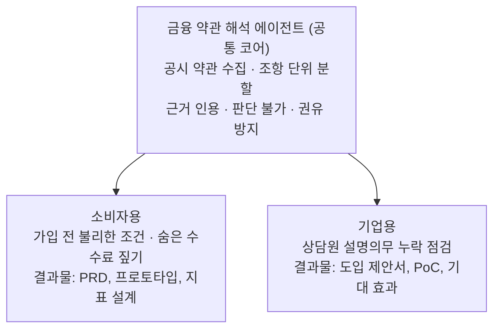

# 콘셉트: 에이전트 코어 하나, 쓰임새 둘

코어는 한 번만 만들고, 누가 쓰느냐에 따라 보여 주는 얼굴만 바꾼다.

## 공통 코어

| 단계 | 하는 일 |
|---|---|
| 수집 | 공시된 약관과 상품설명서를 모은다 |
| 분할 | 조항 단위로 나누고 조항 번호를 붙인다 |
| 해석 | 질문에 맞는 조항을 찾아 근거와 함께 답한다 |
| 검증 | 근거 없는 문장, 권유로 읽히는 표현을 걸러낸다 |
| 평가 | 정답 질문셋으로 정확도를 측정한다 |

## 소비자용

- **장면**: 대출을 받기 전, 앱에서 약관을 열어 보지만 끝까지 읽지 않는다.
- **기능**: "이 대출에서 내가 꼭 알아야 할 조건"을 근거 조항과 함께 보여 준다. 다른 상품과 조건을 비교한다.
- **증명할 것**: 사용자 문제를 찾고, 빠르게 만들어 검증하는 과정. 성과 지표와 실험 설계.

## 기업용

- **장면**: 은행 상담원이 대출 상품을 설명한다. 설명해야 할 항목이 많고, 빠뜨리면 불완전판매 위험이 생긴다.
- **기능**: 상품 약관에서 의무 설명 항목을 뽑아 체크리스트로 만들고, 상담 내용에서 빠진 항목을 짚는다.
- **증명할 것**: 금융사의 업무, 보안 요건(망분리 등), 규제를 이해하고 도입을 설계하는 능력.

## 왜 하나의 코어인가

- 근거 인용과 판단 불가라는 신뢰 설계는 소비자용과 기업용 모두에 똑같이 필요하다.
- 코어를 공유하면 두 번째 쓰임새를 만드는 비용이 작다. 상품을 늘릴 때도 코어는 그대로 쓴다.
